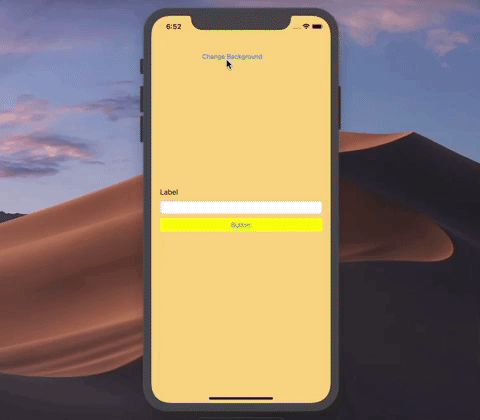

# Pass Deata using Delegate Method rather than Segue

## Our Goal

Its a simplest project to understand delegate method vs segue

## What you will create

We will show how to pass data in between ViewControllers using delegate method rather than segue

## What you will learn

* Segue
* Protocol, Delegate Method


## Let's Learn

Create New Project by name passDataUsingDelegateMethod, Single view apps using Swift language. 

Go to storyboard, add another view controller using Library (Shift+CMD+L)

Add 2 button and one label and another text field on 1st storyboard
Add single label, text field and button on 2nd view controller
Add a cocoa touch class, under UIViewController subclass by named SecondViewController
Select 2nd storyboard, add SecondViewController class from identity inspector

Control + Drag Button from 1st VC to 2nd VC & select show, its create a segue in between
1st to 2nd VC

Go to ViewController, add those following line of code over there

```swift

import UIKit

class ViewController: UIViewController, canReceive {
    
    @IBOutlet weak var textFeildOne: UITextField!
    @IBOutlet weak var labelOne: UILabel!
    
    
    override func viewDidLoad() {
        super.viewDidLoad()
        // Do any additional setup after loading the view, typically from a nib.
    }
    
    @IBAction func btnPressedToSendData(_ sender: Any) {
        performSegue(withIdentifier: "gotoNext", sender: self)
    }
    override func prepare(for segue: UIStoryboardSegue, sender: Any?) {
        if segue.identifier == "gotoNext"{
            let secondVC = segue.destination as! SecondViewController
            secondVC.data = String(textFeildOne.text!)
        secondVC.delegate = self
        }
    }
    
    func dataReceived(data: String) {
        labelOne.text = data
    }
    @IBAction func btnPressToChangeColor(_ sender: Any) {
//        self.view.
        view.backgroundColor = UIColor.red
    }
}
```
Go to SecondViewController, add those following line of code over there

```swift
import UIKit

protocol canReceive {
    func dataReceived(data:String)
}

class SecondViewController: UIViewController {

    @IBOutlet weak var labelTwo: UILabel!
    @IBOutlet weak var textFeildTwo: UITextField!
    var data:String = ""
    var delegate : canReceive?
    
    override func viewDidLoad() {
        super.viewDidLoad()
        labelTwo.text = data
       
    }
    @IBAction func btnPressToGetBack(_ sender: Any) {
        delegate!.dataReceived(data: String(textFeildTwo.text!))
        dismiss(animated: true, completion: nil)
    }
}

```
Run your project & you will get the result like this 


>Check out the full course and more at 

[www.joyonlineschool.com](https://www.joyonlineschool.com/)


